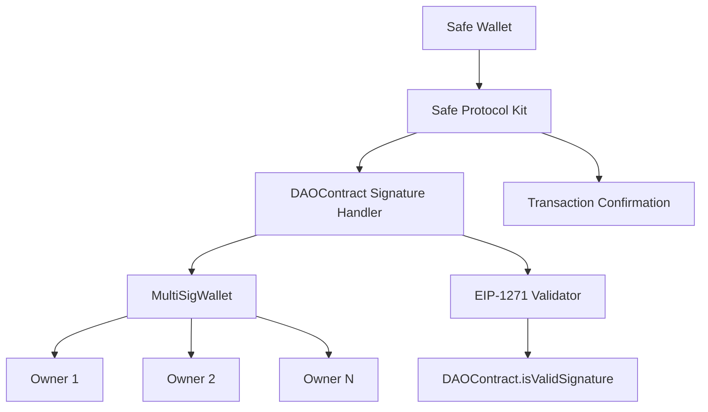

# Design Document

## Overview

Safe Wallet에서 DAOContract의 EIP-1271 서명 검증을 통해 트랜잭션을 확인하는 시스템을 설계합니다. 이 시스템은 Safe Protocol Kit을 활용하여 MultiSigWallet이 소유한 DAOContract가 Safe 트랜잭션에 서명할 수 있도록 합니다.

## Architecture



### 주요 구성 요소:
1. **Safe Protocol Kit**: Safe 트랜잭션 관리
2. **DAOContract Signature Handler**: DAO 서명 프로세스 관리
3. **MultiSigWallet Interface**: 다중 서명 지갑과의 상호작용
4. **EIP-1271 Validator**: 스마트 컨트랙트 서명 검증

## Components and Interfaces

### 1. SafeDAOConfirmationScript
메인 스크립트 클래스로 전체 프로세스를 조율합니다.

```typescript
interface SafeDAOConfirmationScript {
  initializeSafe(safeAddress: string, signerAddress: string): Promise<Safe>
  createTransaction(to: string, value: string, data: string): Promise<SafeTransaction>
  requestDAOSignature(transaction: SafeTransaction): Promise<string>
  confirmTransaction(transaction: SafeTransaction, signature: string): Promise<string>
}
```

### 2. MultiSigWalletHandler
MultiSigWallet과의 상호작용을 처리합니다.

```typescript
interface MultiSigWalletHandler {
  getOwners(): Promise<string[]>
  getRequiredSignatures(): Promise<number>
  submitSignatureRequest(transactionHash: string, data: string): Promise<string>
  getSignatureCount(transactionHash: string): Promise<number>
  executeWhenReady(transactionHash: string): Promise<boolean>
}
```

### 3. DAOContractInterface
DAOContract와의 상호작용을 처리합니다.

```typescript
interface DAOContractInterface {
  isValidSignature(hash: bytes32, signature: bytes): Promise<bytes4>
  getMultiSigWallet(): Promise<string>
  owner(): Promise<string>
}
```

### 4. EIP1271SignatureValidator
EIP-1271 서명 검증을 처리합니다.

```typescript
interface EIP1271SignatureValidator {
  validateSignature(contractAddress: string, hash: string, signature: string): Promise<boolean>
  generateSignatureData(multiSigSignatures: string[]): Promise<string>
}
```

## Data Models

### TransactionRequest
```typescript
interface TransactionRequest {
  to: string
  value: string
  data: string
  operation: number
  safeTxGas: string
  baseGas: string
  gasPrice: string
  gasToken: string
  refundReceiver: string
  nonce: number
}
```

### SignatureRequest
```typescript
interface SignatureRequest {
  transactionHash: string
  safeTransactionHash: string
  daoContractAddress: string
  multiSigWalletAddress: string
  requiredSignatures: number
  currentSignatures: number
  deadline: number
}
```

### MultiSigSignature
```typescript
interface MultiSigSignature {
  signer: string
  signature: string
  timestamp: number
  transactionHash: string
}
```

## Error Handling

### 1. 서명 관련 오류
- **InsufficientSignatures**: 필요한 서명 수가 부족한 경우
- **InvalidSignature**: 서명이 유효하지 않은 경우
- **SignatureTimeout**: 서명 요청이 시간 초과된 경우

### 2. 컨트랙트 상호작용 오류
- **ContractCallFailed**: 스마트 컨트랙트 호출 실패
- **InvalidContractAddress**: 잘못된 컨트랙트 주소
- **InsufficientGas**: 가스 부족

### 3. 네트워크 오류
- **NetworkTimeout**: 네트워크 연결 시간 초과
- **RpcError**: RPC 호출 오류
- **TransactionFailed**: 트랜잭션 실행 실패

## Testing Strategy

### 1. 단위 테스트
- 각 컴포넌트의 개별 기능 테스트
- Mock 객체를 사용한 의존성 격리
- 오류 시나리오 테스트

### 2. 통합 테스트
- Safe Protocol Kit과의 통합 테스트
- MultiSigWallet과의 상호작용 테스트
- EIP-1271 서명 검증 테스트

### 3. 엔드투엔드 테스트
- 전체 서명 프로세스 테스트
- 실제 테스트넷에서의 검증
- 다양한 시나리오 테스트

### 4. 테스트 환경 설정
- Hardhat 로컬 네트워크 사용
- Mock 컨트랙트 배포
- 테스트 데이터 준비

## Implementation Flow

1. **초기화**: Safe Protocol Kit 및 컨트랙트 인터페이스 설정
2. **트랜잭션 생성**: Safe 트랜잭션 생성 및 해시 계산
3. **서명 요청**: MultiSigWallet 소유자들에게 서명 요청
4. **서명 수집**: 필요한 수의 서명이 수집될 때까지 대기
5. **EIP-1271 검증**: DAOContract의 isValidSignature 함수 호출
6. **트랜잭션 확인**: Safe 트랜잭션 최종 확인 및 실행